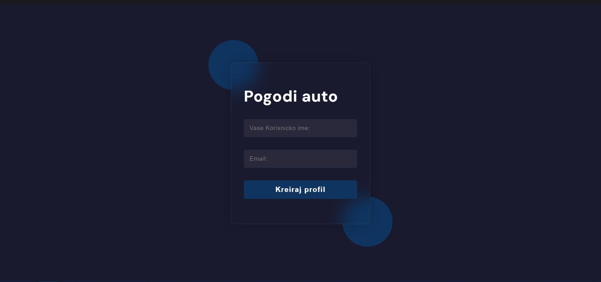

# Pogodi Auto

**Pogodi Auto** is an application where users guess car models based on images, collect points, and compete with other users. The application allows users to sign up and log in, and their scores are saved in a database. A leaderboard displays the top-scoring users.

## Features

- Users can register and log in to the application.
- The system displays car images one by one, and users must guess the car model.
- When the user enters the correct car model, they earn points, and the next car is displayed.
- The current score and the highest score for each user are shown.
- A leaderboard displays the top users with the highest scores.

## Technologies Used in the Project

- **Frontend:**
  - **React**: for building the user interface.
  - **CSS/SCSS**: for styling the application.
  - **Axios**: for communicating with the backend.
  
- **Backend:**
  - **Spring Boot**: as the main framework for the backend application.
  - **Spring Web**: for creating the REST API.
  - **MongoDB**: for storing user data and scores.

## Conclusion

This project is designed to be a fun and interactive application for car enthusiasts. The goal is for users to guess car models through a simple and intuitive interface and compete with other users.

## Screenshots

Here are some screenshots from the project:

1. 
2. 
3. 

